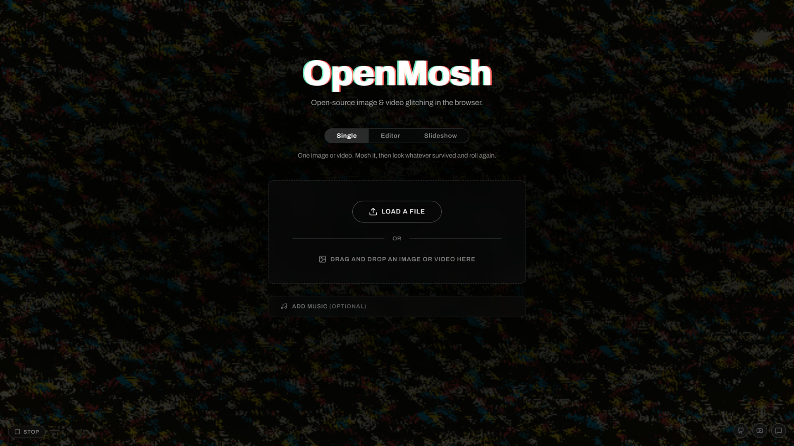
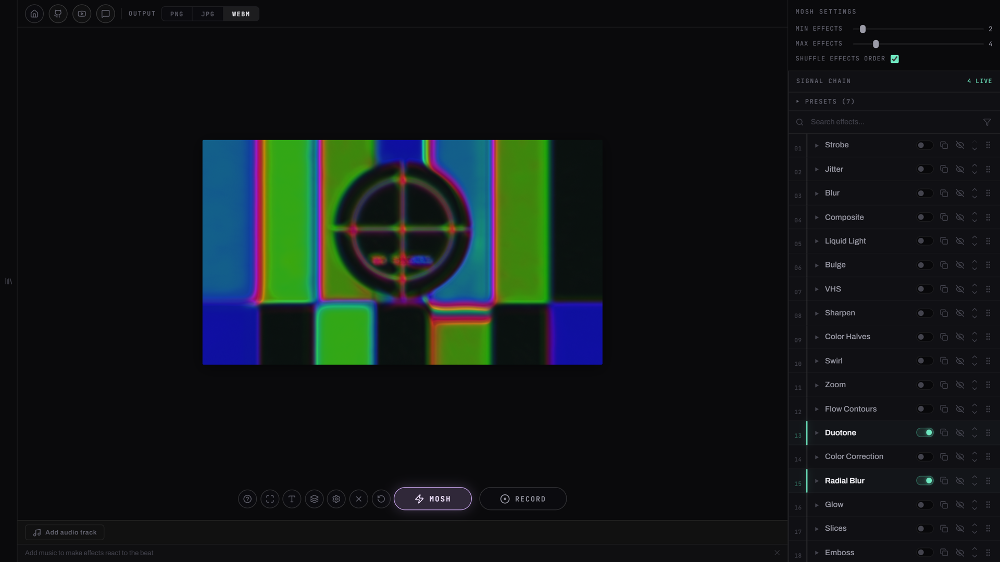
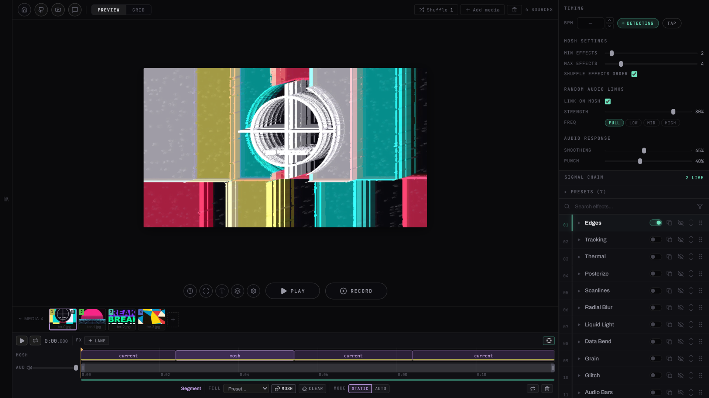

# OpenMosh

A browser-based glitch art studio, inspired by PhotoMosh. Drop in a photo or a video, pile on effects until it falls apart, hook the whole mess up to a song, and save the result. Nothing is uploaded anywhere, it all runs in your browser.

**[open-mosh.vercel.app](https://open-mosh.vercel.app/)**



---

## Getting started

OpenMosh uses [bun](https://bun.sh) as its package manager and runtime.

```bash
bun install        # Install dependencies
bun dev            # Start dev server (Vite)
bun build          # Production build
bun preview        # Preview the production build
bun check          # TypeScript + Svelte type-check
bun test           # Unit suite (bun:test)
bun test:e2e       # End-to-end suite (Playwright, tests/e2e)
```

Built with Svelte 5, Vite, TypeScript and WebGL2. `mediabunny` handles WebM muxing, `essentia.js` does the BPM detection.

---

## How to use it

Pick one of three modes on the upload screen.

**Single** takes one image or video. Hit Mosh and you get a random stack of glitch effects, which you can then tweak one by one, or lock the good ones and re-roll the rest. Add a track and any effect parameter can be wired to a frequency band of the song, so the distortion moves with the music.



**Editor** is a timeline. You upload a batch of media, drop the song in as the master track, then cut it into segments and give each one its own source and its own mosh: a preset, a fixed mosh, or a re-roll that fires on an interval. On top of that sit stacked effect lanes, media layers with their own chains, and a text timeline.



**Slideshow** is the fast one. Throw in a pile of images or videos, let it detect the BPM of your track, and it cuts between them on the beat with effects firing on the grid.

There are 53 effects, from the tame ones (pixelate, posterize, blur) through the usual glitch vocabulary (data bend, pixel sort, VHS, channel split) to things that follow motion or the salient region of the frame. Everything renders in WebGL2 and exports to WebM with audio. No MP4, no GIF.

Keyboard shortcuts live behind the shortcuts button in the app.

## Requirements

A recent Chromium browser (Chrome, Edge, Brave, Arc) is what OpenMosh is built and tested against. Firefox and Safari may load it, but export is the wall: it needs `VideoEncoder`, and support there is newer and patchier.

The browser has to give you:

- WebGL2 with `EXT_color_buffer_float` and a max texture size of at least 4096 — the chain renders through float textures
- WebCodecs (`VideoDecoder` / `VideoEncoder`) with VP8 or VP9 encode, for video sources and for export
- Web Workers, IndexedDB and localStorage

Hardware-wise, anything with a GPU from the last decade previews fine. Export is software VP8 across a worker pool sized off your core count, so a fast multi-core CPU is what makes long exports finish quickly. 8 GB of RAM is comfortable; 4K video sources are the thing most likely to make a machine struggle.

---

## Performance

The chain runs one full-screen shader pass per enabled effect, so cost scales with how many effects are live and with the resolution they run at.

- The preview renders at the size it's displayed, not at the output size. Export switches the renderer to full output resolution for the duration of the capture.
- Video above 1080p gets transcoded to a preview proxy in a worker. OpenMosh times the decode first and picks a 1920 or 1280 long edge depending on how the machine coped. You can turn the proxy off per file when you need to judge the original.
- Export encodes in parallel across worker threads. Chromium runs one software encoder mostly single-pipeline, so more cores means a faster export.

---

## Privacy

Your media never leaves the machine. There is no backend, no account and no upload — files are read straight off disk into the page, everything renders locally, and the export is written by your own browser. Sessions, saved sequences and your track library live in IndexedDB and localStorage on your device.

---

## Status

Version 0.7.2. Single and slideshow modes are settled. The editor is the part still moving, and an update can change the shape of a saved sequence, so treat old projects there as breakable.

MP4 and GIF export were both removed on purpose and aren't coming back.

---

## Contributing

Issues and pull requests are welcome. The conventions worth knowing up front:

- bun, not npm or yarn. Svelte 5 runes only.
- Unit tests sit next to what they cover and run under `bun:test`, for pure logic only. Anything that needs a browser API goes in the Playwright suite under `tests/e2e`.
- Run `bun check` and both test suites before opening a PR. `bunx playwright install chromium` once, first time.
- A new effect is two files: its `EffectDefinition` in `src/lib/effects/definitions.ts`, and its GLSL plus `EffectShaderDef` in `src/lib/gl/effect-shaders.ts`.

---

## Credits

[PhotoMosh](https://photomosh.com/) is what this is chasing. [mediabunny](https://github.com/Vanilagy/mediabunny) does the muxing and the proxy transcodes, [essentia.js](https://mtg.github.io/essentia.js/) the BPM detection, and [lucide](https://lucide.dev/) the icons. Type is Archivo and JetBrains Mono via [Fontsource](https://fontsource.org/), plus the display faces in `public/fonts`, all under the SIL Open Font License.

---

## License

[MIT](LICENSE)
