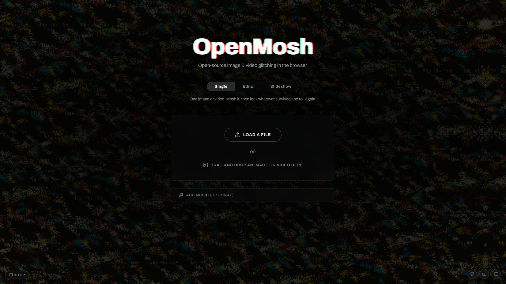
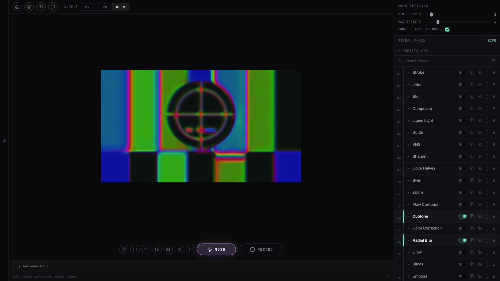
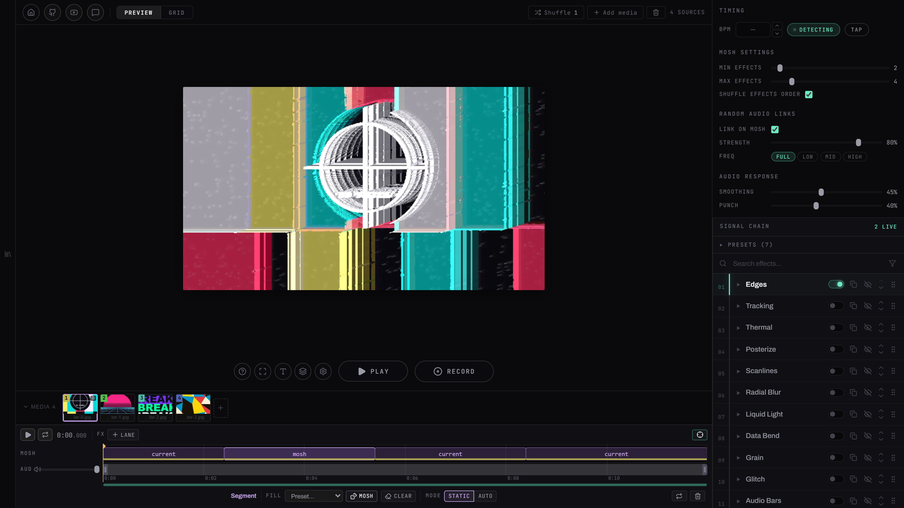

# OpenMosh

A browser-based glitch art studio, inspired by PhotoMosh. Drop in a photo or a video, pile on effects until it falls apart, hook the whole mess up to a song, and save the result. Nothing is uploaded anywhere, it all runs in your browser.

**[openmosh.com](https://openmosh.com/)**



---

## Getting started

OpenMosh uses [bun](https://bun.sh) as its package manager and runtime.

```bash
bun install        # Install dependencies
bun dev            # Start dev server (Vite)
bun run build      # Production build
bun preview        # Preview the production build
bun check          # TypeScript + Svelte type-check
bun test           # Unit suite (bun:test)
bun test:e2e       # End-to-end suite (Playwright, tests/e2e)
```

Built with Svelte 5, Vite, TypeScript and WebGL2. `mediabunny` handles WebM muxing; BPM detection is our own, with no dependencies.

---

## How to use it

Pick one of three modes on the upload screen.

**Single** takes one image or video. Animated GIFs count as video: they come in as a short clip, so they play, scrub and loop like any other one. Hit Mosh and you get a random stack of glitch effects, which you can then tweak one by one, or lock the good ones and re-roll the rest. Set the mosh style to Curated and a roll picks effects that work together instead: it runs them in a sensible order, lets one of them carry the look, and rolls again when the frame comes out blank. Add a track and any effect parameter can be wired to a frequency band of the song, so the distortion moves with the music.



**Editor** is a timeline. You upload a batch of media, drop the song in as the master track, then lay clips out on media layers, each with its own mosh: a preset, a fixed mosh, or a re-roll that fires on an interval. Stacked effect lanes run over the whole frame, and a text timeline sits alongside the layers. Any piece of media can be cropped, keyed, erased by hand and run at its own speed, and a layer clip pasted onto another brings its chain along. 3D models go on layers too: OBJ, STL, GLB and FBX, and animated GLB and FBX files play their animation (an FBX needs its textures embedded). A 3D Transform on a model's clip turns the model itself, not a flat picture of it. The timeline is yours to size — drag the split along its top edge, or double-click it to hand the room back — and any lane you are not working on folds to a strip, one at a time or all at once. Save the whole project as a `.openmosh` file from the project menu, and open it back anywhere: the timeline, the media pool, the song and any custom fonts travel with it.



**Slideshow** is the fast one. Throw in a pile of images or videos, let it detect the BPM of your track, and it cuts between them on the beat with effects firing on the grid.

There are 70 effects, from the tame ones (pixelate, posterize, blur) through the usual glitch vocabulary (data bend, pixel sort, VHS, channel split) to things that follow motion or the salient region of the frame. A Mask effect limits the effects above it to an ellipse, a rectangle, a gradient, the bright parts of the picture, colors you pick from it, a shape you paint or an image you load. Anything with a clock — strobes, rolls, pulses, re-rolls — can run free or lock to the beat of the track. Everything renders in WebGL2 and exports to WebM with audio. No MP4, no GIF.

Keyboard shortcuts live behind the shortcuts button in the app.

## Requirements

A recent Chromium browser (Chrome, Edge, Brave, Arc) is what OpenMosh is built and tested against. Firefox and Safari may load it, but export is the wall: it needs `VideoEncoder`, and support there is newer and patchier.

The browser has to give you:

- WebGL2 with `EXT_color_buffer_float` and a max texture size of at least 4096 — the chain renders through float textures
- WebCodecs (`VideoDecoder` / `VideoEncoder`) with VP8 or VP9 encode, for video sources and for export
- Web Workers, IndexedDB and localStorage

Hardware-wise, anything with a GPU from the last decade previews fine. Export is software VP8 across a worker pool sized off your core count, so a fast multi-core CPU is what makes long exports finish quickly. 8 GB of RAM is comfortable; 4K video sources are the thing most likely to make a machine struggle.

---

## Performance

The chain runs one full-screen shader pass per enabled effect, so cost scales with how many effects are live and with the resolution they run at.

- The preview renders at the size it's displayed, not at the output size. Export switches the renderer to full output resolution for the duration of the capture.
- Video above 1080p gets transcoded to a preview proxy in a worker. OpenMosh times the decode first and picks a 1920 or 1280 long edge depending on how the machine coped. You can turn the proxy off per file when you need to judge the original, or for every video by unticking Optimize large videos in the Mosh settings.
- Export encodes in parallel across worker threads. Chromium runs one software encoder mostly single-pipeline, so more cores means a faster export.

---

## Privacy

Your media never leaves the machine. There's no backend, no account and no upload: files are read straight off disk into the page, everything renders locally, and your own browser writes the export. Sessions, saved sequences and your track library live in IndexedDB and localStorage on your device. After the first visit the app keeps a copy of itself, so it opens and runs offline too. Project files are yours: saving one writes a `.openmosh` file to your disk, and nothing leaves the machine unless you send the file yourself.

Two things do go over the network, and only when you use them. The feedback form sends your message, your email if you give one, the screen you were on, your browser and screen size, and the effect chain you had on through [Web3Forms](https://web3forms.com/), which emails it to me. A report sent from the crash screen also carries the error and where in the code it happened, which can include a file name. A custom font added from a link is downloaded once from wherever the link points (Google Fonts, or the site hosting a font file you pasted), then kept on your device. Project files carry their fonts inside, so opening one downloads nothing, except a Google Fonts link in a file saved by an older version.

---

## Status

<!-- x-release-please-start-version -->

Version 0.9.8. Single and slideshow modes are more or less settled. The editor is still moving, but every past save format is tested on load, so updates bring old projects along. Save a project file now and then anyway: browsers can clear site data, and the file is your backup. See [CHANGELOG.md](CHANGELOG.md) for what each version changed.

<!-- x-release-please-end -->

MP4 and GIF export were both removed on purpose and aren't coming back.

---

## Contributing

Issues and pull requests are welcome. [CONTRIBUTING.md](CONTRIBUTING.md) has the setup, the conventions and how a change gets released. Security problems go in a regular issue too; see [SECURITY.md](SECURITY.md).

---

## Credits

[PhotoMosh](https://photomosh.com/) is what this is chasing. A number of effects are ports: from [X-PostProcessing-Library](https://github.com/QianMo/X-PostProcessing-Library) (RGB Burst, Screen Jump, Sobel Neon) and [Vidvox's ISF-Files](https://github.com/Vidvox/ISF-Files) (HSV Swap, RGB Strobe, Trio Tone, Circle Warp, Pixel Shifter, Ring Warp, Shockwave, Ghosting, Fast Mosh, Resize Glitch, Stylize Glitch, Motion Mask), and the crosswarp, cross zoom and cube transitions in the upload-screen demo come from [gl-transitions](https://gl-transitions.com/), all MIT. [mediabunny](https://github.com/Vanilagy/mediabunny) does the muxing and the proxy transcodes, and [lucide](https://lucide.dev/) the icons. Type is Archivo and JetBrains Mono via [Fontsource](https://fontsource.org/), plus the display faces in `public/fonts`, all under the SIL Open Font License.

---

## License

[MIT](LICENSE)
